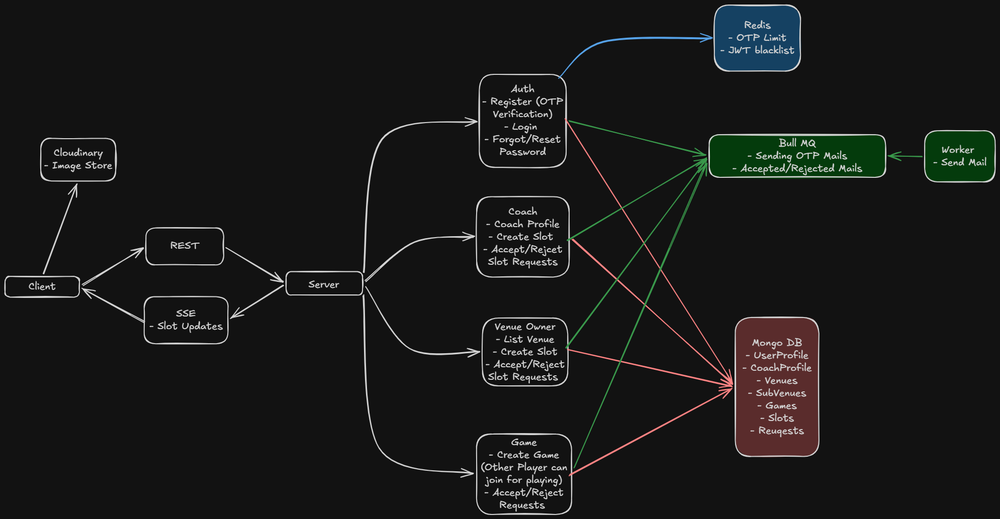

# SportSphere

SportSphere connects players, coaches, and venue owners. Players find coaches, venues, and games. Coaches publish open slots and accept session requests. Venue owners publish courts and accept booking requests.

## Project Overview

SportSphere is a full-stack web application designed to streamline sports-related activities by providing a centralized platform where:
- **Players** can discover games, book venues, and connect with coaches
- **Coaches** can manage their profiles, set availability, and accept session requests
- **Venue Owners** can list and manage their sports facilities and booking slots
- **Admins** can review and approve role applications

The platform supports real-time updates through Server-Sent Events (SSE) and follows a modular backend architecture with distinct modules for each functional area.

## Architecture



## Technology Stack

### Frontend (Client)
- **Framework**: React 19 with TypeScript
- **Build Tool**: Vite
- **Styling**: Tailwind CSS 4
- **UI Components**: Shadcn UI with Lucide React icons
- **State Management**: React Context API
- **Routing**: React Router v7
- **HTTP Client**: Axios

### Backend (Server)
- **Runtime**: Node.js with Express.js
- **Database**: MongoDB with Mongoose ODM
- **Caching / Temporary Storage**: Redis for OTP storage, rate limiting, and JWT blacklist
- **Job Queues**: BullMQ for background email processing
- **Authentication**: JSON Web Tokens (JWT)
- **File Storage**: Cloudinary for image hosting
- **Email Services**: Nodemailer
- **Real-time Updates**: Server-Sent Events (SSE)
- **Logging**: Morgan

## Project Structure

```
SportSphere/
├── client/                 # Frontend React application
│   ├── src/
│   │   ├── App.tsx         # Main application router
│   │   ├── components/     # Shared UI components
│   │   ├── modules/        # Feature-specific modules
│   │   │   ├── auth/       # Authentication flows
│   │   │   ├── coach/      # Coach profile and slots
│   │   │   ├── game/       # Game creation and joining
│   │   │   ├── venue-owner/# Venue management and slots
│   │   │   ├── admin/      # Admin dashboard
│   │   │   ├── profile/    # User profile management
│   │   │   └── booking/    # Booking history
│   │   │   
│   │   ├── pages/          # Page components
│   │   ├── utils/          # Utility functions
│   │   ├── lib/            # API service clients
│   │   ├── constants/      # Application constants
│   │   ├── context/        # React context providers
│   │   ├── assets/         # Static assets
│   │   ├── index.css       # Global styles
│   │   └── main.tsx        # Entry point
│   │   └── index.html      # HTML template
│   ├── public/             # Static public assets
|   |── index.html          # root HTML file
│   ├── package.json        # Frontend dependencies and scripts
│   ├── vite.config.ts      # Vite configuration
│   ├── tsconfig.json       # TypeScript configuration
│   └── .env                # Frontend environment variables
│
├── server/                 # Backend Node.js application
│   ├── src/
│   │   ├── app.ts          # Express app setup and middleware
│   │   ├── server.ts       # Server entry point
│   │   ├── config/         # Configuration files
│   │   │   ├── envConfig.ts      # Environment configuration
│   │   │   ├── mongoConfig.ts    # MongoDB connection
│   │   │   ├── redisConfig.ts    # Redis connection
│   │   │   └── nodeMailerConfig.ts # Email service config
│   │   ├── middleware/     # Custom middleware (auth, validation)
│   │   ├── modules/        # Business logic modules
│   │   │   ├── auth/         # User authentication and authorization
│   │   │   ├── coach/        # Coach profile and slot management
│   │   │   ├── game/         # Game creation and management
│   │   │   ├── venue-owner/  # Venue and subvenue management
│   │   │   ├── booking/      # Booking storage and management
│   │   │   ├── profile-management/ # User profiles and role applications
│   │   │   └── admin/        # Application review and approval
│   │   │   
│   │   ├── service/        # Business logic services
│   │   ├── utils/          # Utility functions
│   │   └── workers/        # Background job workers (email, notifications)
│   ├── package.json        # Backend dependencies and scripts
│   ├── docker-compose.yaml # MongoDB & Redis service configuration
│   ├── .env                # Backend environment variables
│   ├── tsconfig.json       # TypeScript configuration
│   └── nodemon.json        # Nodemon configuration for development
│
└── Readme.md       # Locked dependency versions
```

## Setup & Installation

### Prerequisites
- Node.js (v18+ recommended)
- npm or yarn package manager
- MongoDB running locally on port 27017
- Redis running locally on port 6379

### Environment Setup

#### Backend (.env)
Create a `.env` file in the `server/` directory with the following variables:
```env
PORT=5000
MONGO_URI=mongodb://localhost:27017/sport_sphere
REDIS_URI=redis://localhost:6379
EMAIL_USER=your_email@gmail.com
EMAIL_PASS=your_app_password
JWT_SECRET=your_jwt_secret_key
CLOUDINARY_CLOUD_NAME=your_cloudinary_name
CLOUDINARY_API_KEY=your_cloudinary_api_key
CLOUDINARY_API_SECRET=your_cloudinary_api_secret
CLIENT_URL=http://localhost:5173  # Frontend URL
```

#### Frontend (.env)
Create a `.env` file in the `client/` directory:
```env
VITE_CLIENT_URL=http://localhost:5000  # Backend URL
```

### Dependency Installation

#### Backend Dependencies
```bash
cd server
npm install
```

#### Frontend Dependencies
```bash
cd client
npm install
```

## Running the Project

### 1. Start MongoDB and Redis

From the `server/` directory:

```bash
cd server
docker compose up -d
````

This starts:

* MongoDB on `localhost:27017`
* Redis on `localhost:6379`

To verify the containers are running:

```bash
docker compose ps
```

### 2. Start the Backend

Open a new terminal:

```bash
cd server
npm install
npm run dev
```

The backend will start on:

`http://localhost:5000`

### 3. Start the Frontend

Open another terminal:

```bash
cd client
npm install
npm run dev
```

The frontend will be available at:

`http://localhost:5173`

### 4. Stop MongoDB and Redis

When finished:

```bash
cd server
docker compose down
```

